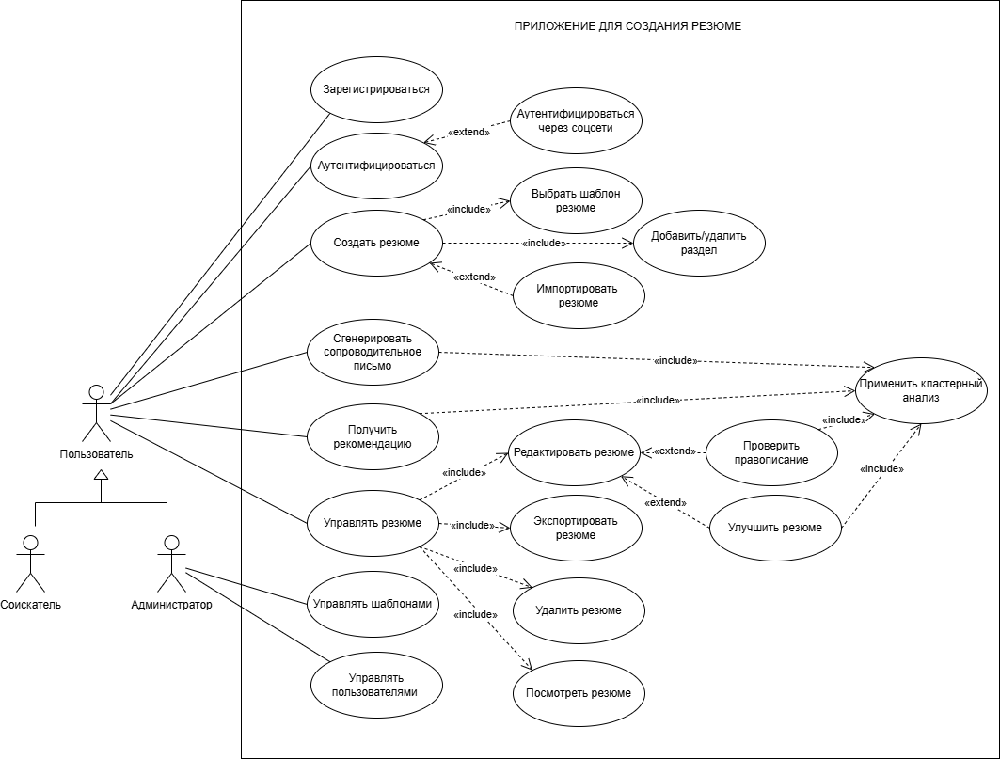
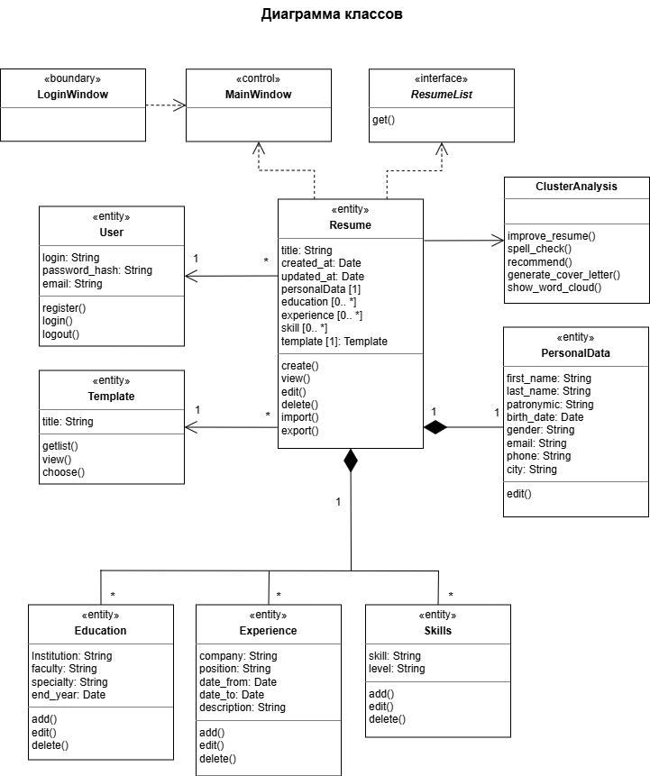

# Resume Builder

Веб-приложение для создания резюме на Django с возможностью экспорта в PDF.

## Установка и запуск
```bash
# Клонировать репозиторий
git clone https://github.com/gl73208/resume_builder.git
cd resume_builder

# Создать виртуальное окружение
python -m venv env
env\Scripts\activate

# Установить зависимости
pip install -r requirements.txt

# Применить миграции
python manage.py migrate

# Запустить сервер
python manage.py runserver
```

Админка будет доступна по адресу http://127.0.0.1:8000/admin/

Приложение будет доступно по адресу http://127.0.0.1:8000/

## Документация

Курсовая работа находится в папке `docs/`

Диаграммы находятся в папке `diagrams/` (исходный файл `UML.drawio` можно редактировать в [draw.io](https://app.diagrams.net))

## Диаграммы
### Диаграмма вариантов использования


### Диаграмма классов

